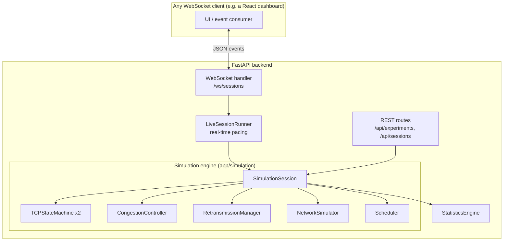

# TCP Network Lab — Backend

An interactive, browser-facing educational simulator of TCP connection behavior — the three-way handshake, data segmentation, packet loss, retransmission, duplicate ACKs, fast retransmit, congestion control (slow start / congestion avoidance), and orderly connection termination — driven by a fully **software-simulated** engine. No real TCP sockets are used anywhere in the simulation; packet loss, latency, jitter, bandwidth limits, and reordering are all deterministically controlled parameters, not artifacts of a real network.

This is the **backend** (Python / FastAPI / WebSockets). It exposes a live simulation over a WebSocket, plus a small REST surface for headless "Experiment Mode" runs and CSV export. It has no UI of its own — pair it with a frontend that speaks the protocol documented below (or drive it directly with a WebSocket client / `curl` for the REST routes).

> **This is a teaching tool, not a production TCP stack.** Every simplification is called out explicitly in the relevant module's docstring (checksums always validate, bandwidth is modeled as serialization delay rather than a shared queue, TIME_WAIT uses a short virtual delay instead of real-world 2×MSL, etc.).

---

## 1. Project overview

You configure network conditions (loss %, latency, jitter, bandwidth, buffer size, reorder probability) and TCP parameters (MSS, initial congestion window, RTO, retry limits), then drive a simulated client↔server connection through its full lifecycle: handshake → data transfer → termination. Every packet, state transition, retransmission, duplicate ACK, and congestion-window change is emitted as a structured event over a WebSocket in real (speed-adjustable) time, so a frontend can animate it and a statistics panel can track it live.

## 2. Architecture



- **`app/models/`** — Pydantic data models: packets, TCP config, network conditions, congestion state, the discriminated-union event types, statistics, and experiment definitions/results.
- **`app/simulation/`** — The engine itself. Fully synchronous and deterministic (seeded RNG), so it's unit-testable with no real waiting:
  - `clock.py` — virtual simulation time, decoupled from wall-clock time.
  - `state_machine.py` — a declarative `(state, trigger) -> state` TCP transition table.
  - `segmenter.py` — splits a message into MSS-sized segments.
  - `congestion_controller.py` — simplified Reno-style slow start / congestion avoidance / fast retransmit / timeout.
  - `retransmission.py` — RTO tracking and duplicate-ACK counting.
  - `network_simulator.py` — applies loss / latency / jitter / bandwidth / buffer / reordering to each packet.
  - `scheduler.py` — a `heapq`-based discrete-event scheduler.
  - `session.py` — `SimulationSession`, the orchestrator tying all of the above together.
- **`app/services/`** — `StatisticsEngine` (pure event reducer), `ExplainMode` (educational annotations), `ExperimentRunner` (headless parallel runs), CSV export.
- **`app/websocket/`** — the live protocol: message parsing (`protocol.py`), the async real-time driver around a `SimulationSession` (`session_runner.py`), per-connection session tracking (`connection_manager.py`), and the route handler (`handlers.py`).
- **`app/api/`** — REST routes for Experiment Mode and session introspection.
- **`app/main.py`** — the FastAPI application entry point.

**Design note:** the simulation engine (`app/simulation/`) has zero dependency on asyncio or WebSockets — it's driven by a single synchronous `session.process_next()` call per scheduled event. `LiveSessionRunner` is a thin async wrapper that paces those calls in real time and translates the engine's internal event bus into WebSocket messages. This is what makes the engine deterministically unit-testable while still supporting a live, pausable, speed-adjustable UI.

## 3. Features

- Three-way handshake, full TCP state machine (`CLOSED` → … → `TIME_WAIT` → `CLOSED`), including the passive-close and simultaneous-close paths.
- MSS-based data segmentation with sequence/ACK number tracking.
- Configurable packet loss, latency, jitter, bandwidth, buffer size, and reordering.
- Retransmission via both RTO expiry and 3-duplicate-ACK fast retransmit.
- Simplified Reno-style congestion control (slow start, congestion avoidance, fast recovery) with a full `cwnd`/`ssthresh` history for charting.
- Live statistics: packets sent/delivered/lost, retransmissions, duplicate ACKs, timeouts, RTT (avg/min/max), throughput, goodput, loss rate.
- **Explain Mode** — optional short, technically-accurate explanations attached to noteworthy events.
- **Network Chaos Mode** — independently toggleable high latency, burst loss, packet bursts, reordering, bandwidth caps, and buffer overflow.
- **Experiment Mode** — run multiple network-condition scenarios headlessly and compare results; export as CSV.
- Pause / resume / speed control, live network/TCP config updates mid-run.

## 4. Technologies used

- **Python 3.11+**, **FastAPI**, **Starlette WebSockets**, **Pydantic v2**, **Uvicorn**
- **pytest** for unit and integration testing (including a full WebSocket protocol test using `TestClient`)
- No database — sessions are in-memory (see the "Future improvements" note below)

## 5. Installation

```bash
cd backend
python3 -m venv venv
source venv/bin/activate        # Windows: venv\Scripts\activate
pip install -r requirements.txt
```

## 6. Running the backend

```bash
cd backend
uvicorn app.main:app --reload --host 127.0.0.1 --port 8000
```

- REST/docs: `http://127.0.0.1:8000/docs` (interactive Swagger UI)
- Health check: `GET http://127.0.0.1:8000/api/health`
- WebSocket: `ws://127.0.0.1:8000/ws/sessions`

Configure allowed frontend origins via the `CORS_ORIGINS` environment variable (defaults to `http://localhost:5173` for a local Vite dev server) — see `app/config.py`.

## 7. Running tests

```bash
cd backend
pip install -r requirements.txt
pytest
```

`pytest.ini` sets `pythonpath = .`, so no manual `PYTHONPATH` juggling is needed. This runs 71 tests: unit tests for every simulation module (state machine, segmenter, congestion controller, retransmission, scheduler, network simulator, statistics reducer) plus integration tests covering the full handshake, data transfer, loss/retransmit/fast-retransmit, termination, and — importantly — the live WebSocket protocol end-to-end via FastAPI's `TestClient`.

Run just one layer:

```bash
pytest tests/unit -q
pytest tests/integration -q
```

## 8. API endpoints

| Method | Path | Purpose |
|---|---|---|
| `GET` | `/api/health` | Liveness check |
| `GET` | `/api/sessions/{session_id}/state` | Snapshot of a live session's state/stats (debugging/polling fallback — prefer the WebSocket for real-time use) |
| `POST` | `/api/experiments/run` | Run one or more `ExperimentDefinition`s headlessly, in parallel; returns `ExperimentResult`s |
| `POST` | `/api/experiments/export-csv` | Convert a list of `ExperimentResult`s into a downloadable comparison CSV |
| `WS` | `/ws/sessions` | The live simulation protocol (see below) |

Full request/response schemas are available at `/docs` while the server is running.

## 9. WebSocket usage

Connect to `ws://<host>/ws/sessions`. The server immediately sends:

```json
{"type": "session_ready", "session_id": "..."}
```

### Client → server messages

Every message is a JSON object with a `type` discriminator:

| `type` | Fields | Effect |
|---|---|---|
| `start_simulation` | — | Begins the handshake (client sends SYN) |
| `pause_simulation` / `resume_simulation` | — | Freezes/resumes the virtual clock |
| `reset_simulation` | — | Discards the session and starts a fresh one with the same config |
| `set_speed` | `multiplier: number` | Scales real-time pacing (e.g. `2.0` = 2× speed) |
| `update_network_config` | `payload: object` | Partial update to loss/latency/jitter/bandwidth/buffer/reorder |
| `update_tcp_config` | `payload: object` | Partial update to MSS/cwnd/RTO/retry/dup-ack-threshold |
| `send_message` | `payload: string` | Segments and transmits an application message (requires `ESTABLISHED`) |
| `close_connection` | — | Client-initiated (active) termination |
| `toggle_chaos_condition` | `condition: string, enabled: bool` | Toggles one Network Chaos Mode flag |
| `toggle_explain_mode` | `enabled: bool` | Turns Explain Mode annotations on/off |

### Server → client messages

Every engine-published event during a single command or tick is flushed **in publish order**, followed by a `stats_snapshot`. Event `type`s include: `state_changed`, `packet_sent`, `packet_delivered`, `packet_lost`, `packet_retransmitted`, `dup_ack_detected`, `fast_retransmit_triggered`, `timeout_occurred`, `cwnd_updated`, `connection_established`, `connection_closed`, `log_message`, and (when Explain Mode is on) `explain_note`. Plus the runner's own `stats_snapshot` and `session_ready` / `error` messages.

## 10. Example simulation

```bash
pip install websocket-client   # any WS client works; this is just for the example
python3 - <<'PY'
import json, websocket

ws = websocket.create_connection("ws://127.0.0.1:8000/ws/sessions")
print(ws.recv())  # session_ready

ws.send(json.dumps({"type": "update_network_config",
                     "payload": {"latency_ms": 40, "packet_loss_percent": 10}}))
print(ws.recv())  # stats_snapshot ack

ws.send(json.dumps({"type": "start_simulation"}))
while True:
    msg = json.loads(ws.recv())
    print(msg["type"])
    if msg["type"] == "connection_established":
        break

ws.send(json.dumps({"type": "send_message", "payload": "HELLO TCP NETWORK"}))
# ...keep reading events (packet_sent, packet_lost, packet_retransmitted,
# cwnd_updated, ...) until the transfer settles, then:
ws.send(json.dumps({"type": "close_connection"}))
PY
```

Or run a headless Experiment Mode comparison via REST:

```bash
curl -X POST http://127.0.0.1:8000/api/experiments/run \
  -H "Content-Type: application/json" \
  -d '{
    "experiments": [
      {"name": "Low Latency",  "network_conditions": {"latency_ms": 10,  "packet_loss_percent": 0},  "message_payload": "hello"},
      {"name": "Lossy Link",   "network_conditions": {"latency_ms": 100, "packet_loss_percent": 15}, "message_payload": "hello"}
    ]
  }'
```

## 11. Documented simulation approximations

- Checksums always validate — only loss, not corruption, is modeled.
- Bandwidth is modeled as per-packet serialization delay, not a true shared-link queue.
- Buffer occupancy is a simple in-flight-byte sum with tail-drop, not a real queuing discipline.
- Out-of-order segments are not buffered/reassembled — the receiver just re-ACKs the last in-order byte, matching real TCP's fallback behavior without the reassembly optimization.
- `TIME_WAIT` uses a short configurable virtual delay instead of the real-world 2×MSL (often minutes), so users aren't stuck waiting.
- Only the client sends application `DATA` in this lab (matching the "type a message, watch it transfer" framing); the server always closes passively.
- Goodput/unique-byte accounting approximates "unique" as "non-retransmission," rather than tracking exact sequence-range coverage.

## 12. Future improvements

- Persistent (database-backed) session/experiment storage instead of in-memory only.
- A `pcap`-style raw export of the packet capture table.
- Additional congestion control algorithms (CUBIC, BBR) as selectable alternatives to the current Reno-style model.
- Multi-flow simulation (several concurrent connections sharing a bottleneck link).
